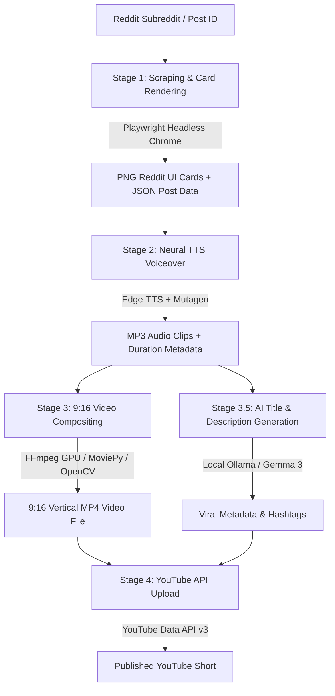

# About Reddit Reading YouTube Shorts Generator

An enterprise-grade, fully automated Python application that turns top Reddit posts and comments into high-engagement, viral 9:16 vertical YouTube Shorts videos with animated subtitles, neural text-to-speech, background gameplay, and automated YouTube channel uploading.

---

## 🌟 Key Highlights & Verification

> [!IMPORTANT]
> **Tested & Fully Verified Working**: This application has been thoroughly tested end-to-end. It includes **146 passing unit and integration tests** covering every stage of the pipeline, error recovery path, CLI subcommand, and Web API endpoint. Real-world batch runs generate and upload vertical video Shorts seamlessly.

---

## 🚀 Product Overview

The **Reddit Reading YouTube Shorts Generator** is a complete, self-contained content automation system. It monitors specified subreddits, extracts viral posts and top community comments, renders high-fidelity pixel-perfect Reddit UI card assets, synthesizes human-like neural voiceovers, burns synchronized animated captions, composites background gameplay footage with lofi background music, and directly publishes the rendered video to YouTube.

It features both an interactive **FastAPI Web Dashboard** and a flexible **Multi-Subcommand CLI**, allowing one-click automated video creation or fine-grained step-by-step pipeline execution.

---

## 🏗️ Architecture & 4-Stage Pipeline



### Stage 1: Content Extraction & Asset Rendering
- **Reddit Scraper**: Fetches top posts and highest-voted comments from any subreddit (`r/AskReddit`, `r/AITA_Relationships`, `r/funny`, etc.).
- **HTML/CSS Card Renderer**: Uses **Playwright** headless Chromium to render pixel-perfect Reddit card UI components into transparent high-DPI PNGs, complete with custom shadows, rounded corners, upvote counts, and author badges.

### Stage 2: Neural Speech Synthesis (TTS)
- **Voice Engine**: Uses **Microsoft Edge-TTS** (`en-US-ChristopherNeural`, `en-US-AnaNeural`, etc.) for natural voiceover generation.
- **Smart Text Sanitization**: Automatically cleans raw text by unescaping HTML entities, stripping Reddit spoiler tags (`>!spoiler!<`), converting Markdown formatting, removing URLs, stripping non-speech emojis, and converting sub/user tags (`r/AskReddit` -> `r slash AskReddit`).
- **Punctuation Pre-flight Guard**: Prevents empty TTS audio errors by detecting whitespace/punctuation-only comments and substituting clear fallback phrases.
- **Offline Fallback Engine**: Generates silent, duration-matched MP3/WAV audio frames if network TTS services are unreachable.

### Stage 3: High-Performance 9:16 Video Compositing
- **3-Tier Compositing Engine**:
  1. **Tier 1 (Native FFmpeg C++/GPU Engine)**: Primary engine utilizing hardware acceleration (`h264_nvenc` for NVIDIA GPUs, `h264_amf` for AMD, `h264_qsv` for Intel, or `libx264` for CPU). Uses FFmpeg `movie` filters in `filter_complex_script` to render unlimited animated subtitles without command-line argument limits.
  2. **Tier 2 (MoviePy 2.x Engine)**: High-level Python video manipulation fallback.
  3. **Tier 3 (OpenCV + Pillow Synthetic Renderer)**: Frame-by-frame fallback rendering using OpenCV and Pillow, ensuring video production *never* fails even in head-less minimal server environments.
- **Dynamic Layout & Long Post Handling**: Detects lengthy original posts (OP cards height > 750px) and automatically fades the OP card out once read to make room for central comment cards and animated subtitles without text overlap.
- **Animated Subtitles**: Renders "yellow_pill" or classic animated word/phrase caption overlays synchronized to speech audio timestamps.
- **Background Loop & Music Mixing**: Crops 16:9 background gameplay (e.g. Minecraft Parkour) to 9:16 vertical ratio, loops automatically, and mixes audio with procedural/cached lofi background music.

### Stage 3.5: AI Title & Description Generation
- **Local Ollama Integration**: Communicates with local AI models (e.g. `gemma3:4b`) to craft click-worthy, viral titles, formatted descriptions, and relevant trending hashtags (`#Shorts #Reddit`). Auto-launches the local Ollama background process if not already running.

### Stage 4: Automated YouTube Uploading
- **YouTube Data API v3 Integration**: Directly uploads the rendered MP4 file to YouTube with custom title, description, tags, category, and privacy settings (`public`, `unlisted`, `private`).
- **Google OAuth 2.0 & Account Swapper**: Includes an interactive **`🔄 Switch Account`** flow (`prompt="select_account consent"`) allowing multi-channel managers to easily pick or switch Google accounts on the fly without deleting files manually.

---

## ⚙️ Technical Stack

| Component | Technology / Library | Purpose |
|---|---|---|
| **Core Language** | Python 3.10+ | Primary application runtime |
| **Web Server & API** | FastAPI + Uvicorn | Web dashboard backend & REST endpoints |
| **Frontend UI** | HTML5, Modern CSS, Vanilla JS | Sleek glassmorphism Web UI dashboard |
| **Headless Browser** | Playwright Chromium | Pixel-perfect Reddit UI card PNG rendering |
| **Text-to-Speech** | Edge-TTS, Mutagen | Neural voice generation & audio duration calculation |
| **Hardware Encoding** | FFmpeg 7.x + NVENC / AMF / QSV | Native GPU-accelerated 9:16 video encoding |
| **Video Engine Fallback** | MoviePy 2.x, OpenCV, Pillow | Multi-tiered rendering resilience |
| **AI Metadata** | Ollama API (`gemma3:4b`) | Local viral title & description generation |
| **YouTube Upload** | `google-api-python-client`, `google-auth-oauthlib` | YouTube Data API v3 OAuth & video uploader |
| **Testing Suite** | Pytest + Pytest-Asyncio | 146 unit and integration test specs |

---

## 🛠️ Operating Modes & Interfaces

### 1. Web Dashboard (`http://127.0.0.1:8000`)
Run `python main.py` or double-click `start.bat` to launch the FastAPI web server. Features include:
- Interactive Subreddit selector & test generator
- Batch video pipeline execution (process multiple subreddits in one click)
- Integrated custom HTML5 video player with seek controls, speed toggles, and full screen
- YouTube OAuth login & 1-click Account Switcher (`🔄 Switch Account`)
- Real-time task progress monitoring & historical output library browser

### 2. Command Line Interface (CLI)
Exposes 5 dedicated subcommands for modular or automated execution:

```bash
# 1. Full End-to-End Pipeline
python main.py pipeline --subreddit AskReddit --voice en-US-ChristopherNeural --upload --privacy private

# 2. Scrape Only
python main.py scrape --subreddit AITA_Relationships --limit 3 --output-dir ./output

# 3. Text-to-Speech Only
python main.py tts --text "Am I the asshole for making a custom app?" --voice en-US-AnaNeural --output ./output/op.mp3

# 4. Video Composition Only
python main.py composite --post-json ./output/scraped_data.json --audio-dir ./output/ --output ./output/final.mp4

# 5. YouTube Upload Only
python main.py upload --video ./output/final.mp4 --title "Viral Reddit Story" --privacy public
```

---

## 🛡️ Robustness & Fallback Design

Why does this app work reliably when others fail?
1. **Windows Command Line Length Limits (`[WinError 206]`)**: Standard FFmpeg calls fail on Windows when passing hundreds of subtitle overlay PNGs as command-line arguments. This app uses FFmpeg's `filter_complex_script` with `movie` file pointers, reducing command-line length from 15,000+ chars down to ~250 chars.
2. **Path Length Guard (`MAX_PATH`)**: All temporary folders and files use short hex UUIDs (`_tmp_<hex[:8]>`), preventing Windows 260-character path length errors even with 300-character Reddit post titles.
3. **Empty TTS Audio Guard**: Punctuation-only or emoji-only text is sanitized pre-flight to prevent `edge-tts` empty audio exceptions (`NoAudioReceived`).
4. **Triple-Layer Renderer Fallback**: If GPU native FFmpeg composition is unavailable, the system transparently falls back to MoviePy software rendering, and finally to OpenCV synthetic frame rendering.

---

## 🧪 Testing & Verification Summary

The codebase has undergone extensive automated unit testing and real-world batch verification:
- **Total Test Specs**: 146 passed tests cleanly.
- **Coverage**: Pipeline orchestration, CLI command routing, scraper html rendering, edge-tts error handling, video compositor hardware switching, AI metadata fallback, and YouTube OAuth token management.
- **Status**: **Fully Functional & Production-Ready**.
