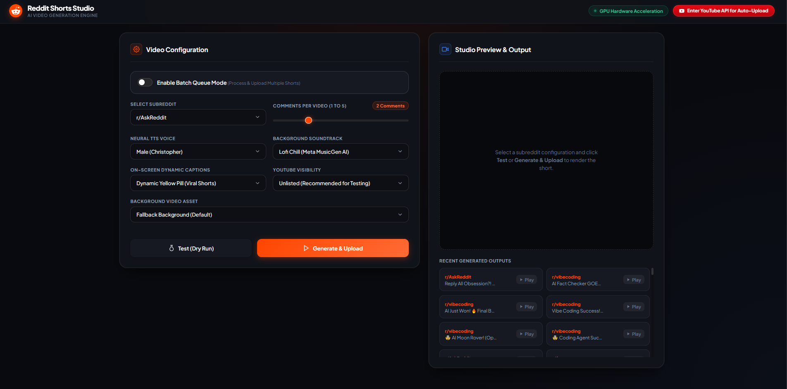
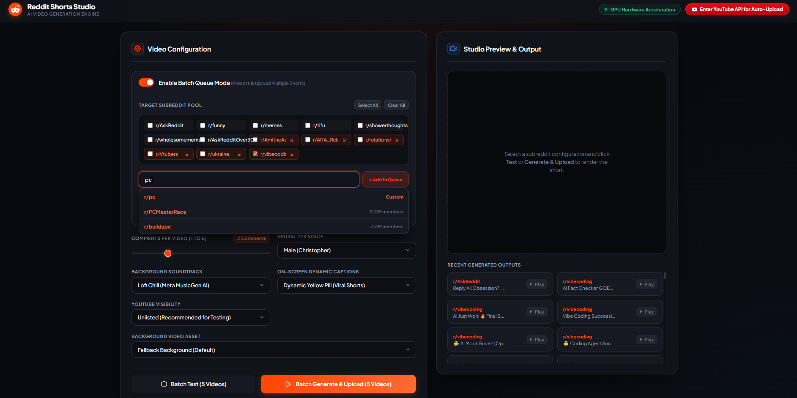
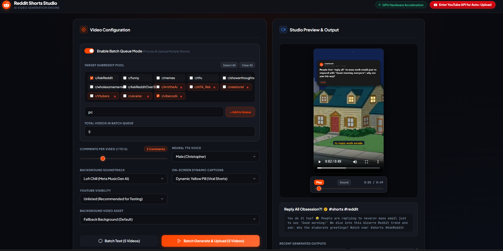

# 🎬 Reddit Reading YouTube Shorts Generator

Automated, high-performance pipeline and Web Studio for generating and uploading viral 9:16 vertical YouTube Shorts from top Reddit posts and comments.


---

## 🎥 App Demonstration

<div align="center">
  <video src="https://raw.githubusercontent.com/BloopieBlair/RedditReadingApp/master/docs/demo.mp4" controls="controls" width="100%" poster="docs/screenshots/studio_dashboard.png">
  </video>
  <p align="center">
    🎬 <strong><a href="https://raw.githubusercontent.com/BloopieBlair/RedditReadingApp/master/docs/demo.mp4">▶ Click here to view / play the full HD Demo Walkthrough Video (docs/demo.mp4)</a></strong>
  </p>
</div>

---

### 📸 Studio Screenshots

<p align="center">
  
</p>

<p align="center">
  
  
</p>

---

## ✨ Features

- **🌐 Reddit Scraping Engine**: Dual-path scraper utilizing headless Chromium (Playwright) and public JSON API fallbacks to fetch top stories, comments, upvotes, and metadata with built-in deduplication history.
- **🎨 Dark Mode Card Renderer**: HTML/CSS Jinja2 screenshot renderer creating Reddit post & comment cards (with pure-Python Pillow fallback).
- **🎙️ Neural TTS Voiceover**: Microsoft Edge Neural TTS with natural male and female voices (Christopher, Guy, Ana, Jenny).
- **🎞️ GPU Hardware-Accelerated Compositor**: Hardware encoding supporting NVIDIA NVENC (`h264_nvenc`), AMD AMF (`h264_amf`), and Intel QSV (`h264_qsv`) with automatic fallback to CPU `libx264`, rendering vertical 1080x1920 60/30fps videos.
- **💬 Viral Word-Level Dynamic Subtitles**: On-screen animated captions ("Yellow Pill", "Neon Cyan Glow", "Minimalist White") synchronized with voiceover timestamps.
- **🎵 AI Soundtrack Generator**: Meta MusicGen (`facebook/musicgen-small`) soundtrack synthesis with local DSP Lofi beat fallback.
- **🧠 Local LLM Metadata Engine**: Automatically generates catchy titles, engaging descriptions, and hashtags using local Ollama models (e.g. Gemma 3).
- **📦 Batch Queue Mode**: Generate and queue multiple shorts across custom subreddit pools.
- **🚀 YouTube Data API v3 Auto-Upload**: Direct OAuth2 resumable upload flow with unlisted, public, or private visibility.
- **🖥️ Web Studio UI**: Modern dark-mode FastAPI control room with live preview, video scrubber, background manager, and one-click YouTube API setup.

---

## 🚀 Quick Start

### 1. Prerequisites
- **Python 3.10+** (Python 3.11 recommended)
- **FFmpeg** (installed or automatically resolved via `imageio-ffmpeg`)
- Optional: **GPU** (NVIDIA with NVENC, AMD with AMF, or Intel with QuickSync) for hardware acceleration
- Optional: **Ollama** installed locally (`ollama run gemma3:4b`) for viral AI titles & descriptions

### 2. Installation

Clone the repository:
```bash
git clone https://github.com/BloopieBlair/RedditReadingApp.git
cd RedditReadingApp
```

Create and activate a virtual environment:
```bash
# Windows
python -m venv .venv
.\.venv\Scripts\activate

# Linux / macOS
python3 -m venv .venv
source .venv/bin/activate
```

Install dependencies:
```bash
pip install -r requirements.txt
playwright install chromium
```

### 3. Launch Web Studio

```bash
# Windows quick launcher
start.bat

# Or run via Python
python -m src.web.app
```
Open your browser and navigate to: **`http://127.0.0.1:8000`**

---

## 🔑 YouTube API Setup for Auto-Upload

To enable automatic uploading of generated Shorts directly to your YouTube channel:

1. Click **`Enter YouTube API for Auto-Upload`** in the top-right header of the Web Studio.
2. In the setup modal, you can either:
   - **Enter your OAuth Client ID & Client Secret**, OR
   - **Upload your `client_secret.json`** file directly from Google Cloud Console.

### How to get Google Cloud OAuth Credentials:
1. Visit the [Google Cloud Console](https://console.cloud.google.com/).
2. Create a new project (e.g. `Reddit-Shorts-Generator`).
3. Under **APIs & Services > Library**, search for **YouTube Data API v3** and click **Enable**.
4. Under **APIs & Services > OAuth consent screen**, select **External**, provide an app name, and add your Google email address under **Test users**.
5. Under **APIs & Services > Credentials**, click **Create Credentials > OAuth client ID**.
6. Select **Desktop app** as the application type.
7. Download the `client_secret.json` or copy the Client ID and Client Secret into the Web Studio modal.
8. Click **Connect & Authorize YouTube** to complete the one-time Google browser login.

---

## 🎮 Custom Background Footage & Auto-Cropping

You can easily use your own background gameplay videos (e.g. Minecraft parkour, Subway Surfers, GTA V stunt races, satisfying ASMR, etc.):

### How to add custom background videos:
1. **Drop your video into `assets/backgrounds/`** (supports `.mp4`, `.mov`, `.webm`, `.mkv`), OR
2. **Select or upload it via the Web Studio UI** in the Background Video selector.

### 🔄 Intelligent 9:16 Vertical Auto-Cropping:
- **Universal Aspect Ratio Support**: You can provide footage of any resolution or orientation (16:9 widescreen, 4:3, ultra-wide, or vertical 9:16).
- **Automated Center Crop & Scaling**: The background engine automatically computes aspect ratios, removes letterboxing, and rescales footage to crisp **1080×1920 (9:16 vertical)** format.
- **Randomized Dynamic Start Points**: For long gameplay footage (e.g. 10–20 minute clips), the compositor automatically samples a fresh, random starting timestamp for each generated short so your channel videos remain dynamic and visually unique.
- **Seamless Looping**: If your background clip is shorter than the narrated story, the engine automatically loops the footage smoothly without frame drops.
- **Persistent Library for Re-use**: All placed backgrounds remain indexed in your local library for instant selection in both single-video and batch generation runs without needing to re-process.

---

## 💻 CLI Usage

You can also run every pipeline stage directly via the command line:

```bash
# Run full end-to-end pipeline in dry-run test mode
python main.py pipeline --subreddit AskReddit --dry-run

# Run full pipeline and upload to YouTube (unlisted)
python main.py pipeline --subreddit funny --upload --privacy unlisted

# Scrape top post and render HTML cards
python main.py scrape --subreddit AskReddit --limit 5

# Generate TTS voiceover from custom text
python main.py tts --text "This is a test Reddit story narration." --voice en-US-ChristopherNeural --output test.mp3

# Composite short video from existing scraped assets and audio
python main.py composite --post-json output/post.json --audio-dir output/audio/ --output output/short.mp4

# Upload an existing video to YouTube Shorts
python main.py upload --video output/short.mp4 --title "Incredible Reddit Story" --privacy unlisted
```

---

## 🧪 Testing

Run the test suite:
```bash
python -m pytest
```

---

## 📁 Repository Structure

```
RedditReadingApp/
├── assets/
│   ├── backgrounds/          # 9:16 background video assets
│   ├── music/                # AI generated & DSP soundtracks
│   ├── templates/            # Jinja2 card HTML templates
│   └── client_secret.json.example
├── src/
│   ├── scraper/              # Reddit scraper & card renderers
│   ├── tts/                  # Neural TTS voice engine
│   ├── video/                # Video compositor & subtitle overlays
│   ├── uploader/             # YouTube OAuth & upload manager
│   ├── web/                  # FastAPI web server & UI
│   ├── ai_generator.py       # Ollama/Gemma viral metadata generator
│   ├── cli.py                # Command line interface
│   ├── config.py             # App configurations & paths
│   ├── history.py            # Post deduplication tracker
│   ├── models.py             # Pydantic & dataclass schemas
│   └── pipeline.py           # Orchestration & batch pipeline
├── tests/                    # Unit, integration & adversarial test suite
├── .env.example              # Example environment variables
├── .gitignore                # Git exclusions
├── main.py                   # CLI entrypoint
├── pyproject.toml            # Project metadata & pytest configuration
├── requirements.txt          # Python dependencies
└── start.bat                 # Windows quickstart script
```

---

## Support Development

This project is free and open source. If it saved you time or you would
like to support continued development, you can optionally support me on
[Ko-fi](https://ko-fi.com/bloopieblair).

Donations do not unlock additional features or support. Every public
release remains freely available here on GitHub.

---

## 📄 License

This project is licensed under the MIT License - see the LICENSE file for details.
